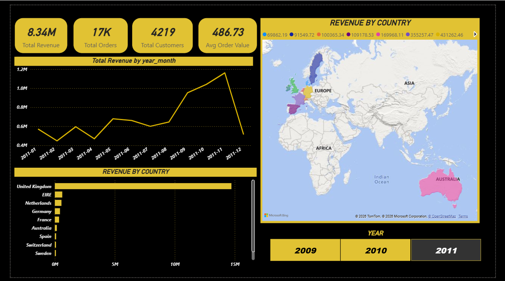
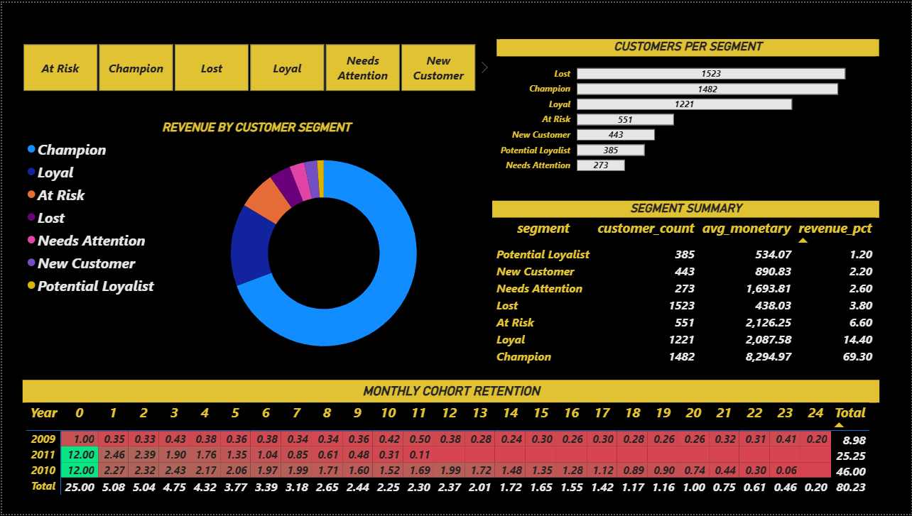
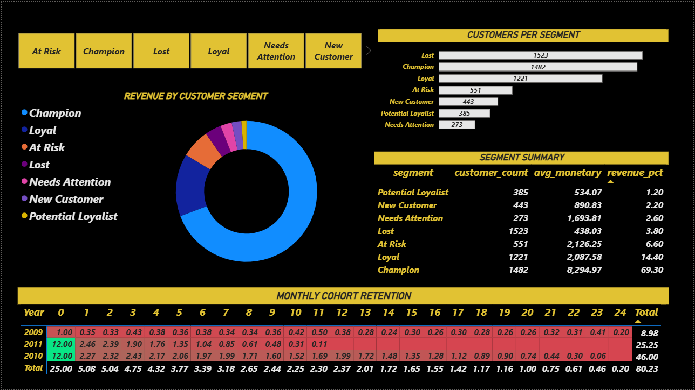

# FMCG Customer Purchase Behavior Analysis

## Project Overview
End-to-end data analysis project analyzing customer purchase behavior 
for a UK-based FMCG wholesaler. Built using Python, SQL, and Power BI 
to replicate real-world analyst workflows.

**Dataset:** Online Retail II (UCI ML Repository) — 1M+ transactions, 
Dec 2009 to Dec 2011

---

## Tools & Skills Used
| Tool | Purpose |
|---|---|
| Python (pandas) | Data cleaning & feature engineering |
| SQL (SQLite) | Business queries & product affinity analysis |
| Power BI | Interactive dashboard with DAX measures |
| Excel | Sanity checking & validation |

---

## Project Structure
fmcg-customer-analysis/
│
├── 01_data_cleaning.ipynb       # Raw data cleaning & validation
├── 02_rfm_analysis.ipynb        # RFM customer segmentation
├── 03_cohort_analysis.ipynb     # Monthly cohort retention analysis
├── 04_basket_analysis.ipynb     # SQL product affinity analysis
│
├── outputs/
│   ├── rfm_segment_summary.csv  # RFM segment results
│   ├── sql_product_pairs.csv    # Product pair frequencies
│   └── cohort_heatmap.png       # Retention heatmap
│
└── dashboard/
├── page1.png                # Executive Overview
├── page2.png                # Customer Segments
└── page3.png                # Product Intelligence
---

## Dashboard Preview

### Page 1 — Executive Overview

### Page 2 — Customer Segments

### Page 3 — Product Intelligence

---

## Key Findings

### 1. Champions drive disproportionate revenue
25% of customers (Champions) generate 69.3% of total revenue (£12.3M 
of £17.7M). This is stronger than the typical 80/20 rule — it's an 
80/25 pattern.

### 2. At-Risk customers represent £1.17M recoverable revenue
551 customers who historically averaged £2,126 spend have not 
purchased in over 300 days. Targeted re-engagement campaigns should 
prioritize this segment.

### 3. Colour-variant bundling is the strongest purchase pattern
The top 20 product pairs are all colour or size variants bought 
together (e.g. RED vs WHITE Hanging Heart T-Light Holder — bought 
together 1,343 times). Recommendation: create pre-packaged colour 
bundles.

### 4. Strong seasonal pattern — Oct/Nov revenue spikes every year
Monthly revenue peaks at £1.1M–£1.2M in October/November each year, 
driven by retailers stocking up ahead of Christmas. Supply chain and 
procurement planning should account for this 2x demand spike.

### 5. Cohort retention stabilises at ~21% from Month 3 onwards
Average Month-1 retention is 21.2% — meaning roughly 8 in 10 new 
customers never return after their first purchase. However retention 
stabilises at 21.6% by Month 3 and holds steady, indicating that 
customers who return once tend to become consistent repeat buyers. 
Improving Month-1 retention is the highest-leverage growth opportunity.

---

## Data Cleaning Summary
Raw dataset: ~1,000,000 rows
Removed: ~195,000 rows (cancellations, missing CustomerIDs, 
negative quantities, zero-price entries)
Final clean dataset: 805,549 transactions, 5,878 customers, 
41 countries, Dec 2009–Dec 2011

---

## How to Run
1. Download the dataset from 
[UCI ML Repository](https://archive.ics.uci.edu/dataset/502/online+retail+ii)
2. Place `online_retail_II.xlsx` in the `data/` folder
3. Run notebooks in order: 01 → 02 → 03 → 04
4. Open `FMCG_Customer_Analysis.pbix` in Power BI Desktop
